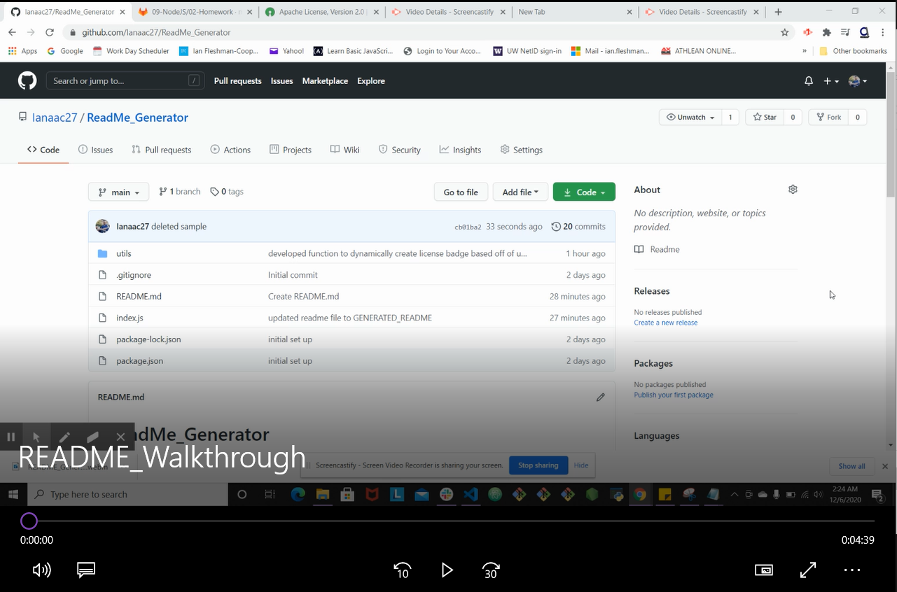

# ReadMe_Generator

## Description

This is an application that generates README.md files. This is processed by using prompts within node.JS, which is done through the npm "Inquirer". This project demonstrates my skils in JavaScript as well as in Node.JS.

## Table of Contents

* [Installation](#installation)
* [Usage](#usage)
* [License](#license)
* [Contributing](#contributing)
* [Tests](#tests)
* [Questions](#questions)

## Installation

To install this project, you will need to download Node.JS as well as the npm "Inquirer".

## Usage

After you have installed node.js and npm "Inquirer", you will then be able to access node through the command line. From here, a series of prompts will begin to ask you questions regarding information you would like to be generated onto your README. After you have answered all questions, your new README will be generated.

## License

MIT

## Contributing

Ianaac27

## Tests

## Questions

If you have any questions, please refer to my contact information below.

[GitHub: Ianaac27](https://www.github.com/Ianaac27)

Email: ian.fleshmancooper@gmail.com
